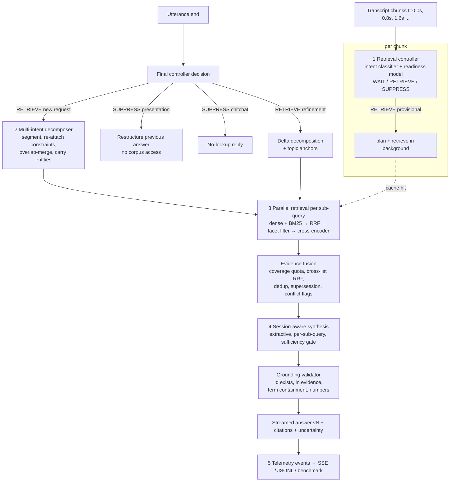

# Architecture Brief — Streaming Live RAG

Theme 4, Samsung PRISM GenAI Hackathon 2026–27. This brief covers the design rationale, retrieval trigger logic, decomposition strategy, data provenance, trade-offs and failure mitigations, as the Theme 4 guide's deliverables checklist asks.

## 1. What is different from conventional RAG

| Conventional (turn-based) RAG | This system |
|---|---|
| Waits for the end of the utterance, then searches | Searches **while the user is still speaking** once the partial transcript is specific enough |
| One utterance → one query | One utterance → **N sub-queries**, retrieved in parallel, fused |
| Every turn searches the corpus | **Suppresses** retrieval for presentation-only and conversational turns |
| A follow-up detail restarts the pipeline | A follow-up detail becomes a **delta query**; prior claims and citations are kept; answer **v1 → v2** |
| Citations are best-effort | Every claim passes a **grounding validator** (id exists, was retrieved, text and numbers match) |
| Opaque | Every decision is an **event** on one clock (UI, SSE, JSONL, benchmark all read the same stream) |

## 2. Pipeline

Code map (`backend/app/`):

| Stage | Module |
|---|---|
| Ingestion and chunking (md, txt, json/jsonl, pdf, docx) | `ingestion/loader.py` |
| Answer-coverage / abstention signal | `grounding/coverage.py` |
| Dense / BM25 / hybrid index | `retrieval/index.py`, `retrieval/bm25.py`, `retrieval/embedder.py` |
| Facet filter | `retrieval/facets.py` |
| Parallel retrieval service | `retrieval/service.py` |
| Reranker (pluggable) | `reranking/rerankers.py` |
| Evidence fusion | `retrieval/fusion.py` |
| Controller | `controller/retrieval_controller.py` |
| Decomposer | `decomposition/decomposer.py` |
| Turn engine / baseline | `streaming/engine.py`, `streaming/baseline.py` |
| Synthesis | `synthesis/extractive.py`, `synthesis/llm.py` (optional), `synthesis/restructure.py` |
| Grounding | `grounding/validator.py` |
| Session memory | `sessions/store.py` |
| Telemetry | `telemetry/events.py` |
| API (SSE) | `api/routes.py`, `main.py` |

## 3. Retrieval trigger logic (controller)

The controller runs on **every transcript chunk**, not every token. It never searches the corpus to decide; it only embeds the prefix (MiniLM, cached) and looks words up in the BM25 vocabulary.

**Intent classifier.** This is a logistic regression over the 384-d prefix embedding plus six scalars: question form, has-prior-answer, similarity to the previous topic, short utterance, *new corpus content relative to the topic* (refinements add searchable constraints; presentation requests do not), and *imperative-on-previous-answer* ("put that…", "make it…"). It outputs `new_request | refinement | presentation | chitchat`. It is trained on `configs/controller_train.jsonl` (about 120 labelled utterances), which is disjoint from the benchmark.

**Readiness model.** This is a logistic regression over six corpus-aware features of the partial transcript:

| Feature | Meaning | Learned weight |
|---|---|---|
| `n_content` | distinct in-vocabulary content words | + |
| `idf_mass` | how specific those words are | + (largest) |
| `dangling` | prefix ends in "the / for / and / need …" | − |
| `new_content` | words not yet retrieved for | + |
| `drift` | 1 − cos(prefix, previous prefix) | small + |
| `has_entity` | a corpus proper noun (e.g. *Pune*) is present | + |

It is trained on 15 labelled chunk streams (54 prefixes). The weights are exported in `/api/health` and `results/benchmark.json`.

**Deterministic guardrails:**
- Never RETRIEVE twice for the same content (`new_content ≥ 1`).
- presentation and refinement both require a prior answer in the session.
- At utterance end the controller always resolves to RETRIEVE or SUPPRESS.
- A turn with no searchable content is suppressed, unless it is a refinement.

**Provisional retrieval.** On RETRIEVE, planning and retrieval run as a background task while chunks keep arriving. Results are cached by the set of in-vocabulary content stems of each sub-query. At utterance end the final decomposition reuses any sub-query whose key is already cached (`RETRIEVAL_REUSED`), and only the rest is searched.

`controller_mode=rule` swaps both models for a keyword list and a "≥ 3 content words" rule. It exists as the ablation the guide asks for.

**Speculative synthesis prep.** When a provisional retrieval completes, the answer sentences of its top chunks are scored straight away, still during speech (`SYNTHESIS_PREPARED`). At utterance end, a reused sub-query whose fused evidence is unchanged skips the cross-encoder entirely.

## 4. Decomposition strategy

1. Segment on coordination boundaries (`, and`, `;`, `?`, `as well as` …). This over-splits deliberately.
2. Re-attach fragments that start with a preposition ("for 30 people") or have fewer than 2 content words. These are constraints of the previous clause, not separate intents.
3. Probe each clause against the corpus. Adjacent clauses merge only if they share the **same best section** and their top-3 sections overlap (Jaccard ≥ 0.5). The corpus itself decides whether two phrasings are one need, which guards against the *over-fragmenting* pitfall.
4. Carry context entities (words the corpus writes as proper nouns) to sibling sub-queries: "the cancellation policy" → "cancellation policy Pune".
5. Label each intent with the top section's heading, a grounded label rather than an invented category.
6. Treat statements that carry no request verb and precede a question as that question's context ("We have customers visiting next week; how do I register them…"). They merge forward instead of becoming intents. Short *questions* are never attached as constraints.
7. Compute a **focus span** for answer selection: the words after the last wh-word or request marker ("…I'd like to know **the daily meal allowance for international travel**"). Retrieval uses the full clause plus carried context; sentence scoring and abstention use the focus.

The probe results are reused as the sub-query's retrieval candidates, so decomposition adds no extra corpus pass. There is no LLM on the hot path.

## 5. Retrieval, fusion, reranking

- **Hybrid:** exact dense cosine (normalised MiniLM, title and heading prepended) plus Okapi BM25 over stemmed content words, combined with RRF (k = 60). A chunk that BM25 did not match gets no sparse vote.
- **Facet filter:** document families are detected automatically as titles identical up to a proper noun ("Approved Event Venues – Pune / – Bengaluru"). If the query names a family's facet value, siblings with a different value are dropped.
- **Reranker:** the `cross-encoder/ms-marco-MiniLM-L6-v2` cross-encoder scores (query, "title – heading. text"). It sits behind a `Reranker` protocol; `NoopReranker` disables it for ablations.
- **Quantity constraints:** neither ranker compares numbers, so a request that says "for 30 people" is checked explicitly (`retrieval/constraints.py`).
  - The phrase is read as a minimum.
  - If none of the sub-query's top 3 chunks states at least 30 people, up to 2 chunks that do are moved in behind the top result.
  - Synthesis then selects sentences that satisfy the constraint first.
  - The baseline does not use this; it is measured by `ablation_no_quantity_constraints`.
- **Fusion across sub-queries:**
  1. A coverage quota admits the top 2 of every sub-query first, so a strong intent cannot crowd out a weak one.
  2. Cross-list RRF fills the remaining slots.
  3. Near-duplicates (token Jaccard ≥ 0.8) are dropped and their provenance is merged.
  4. Documents marked `superseded_by` are dropped when the newer one is in the evidence, and flagged otherwise.
  5. Same-topic chunks from different documents that state different numbers are flagged as potential conflicts, never silently merged.

## 6. Session-aware synthesis and refinement

**Extractive synthesis (default).** For each sub-query, the synthesizer:
1. takes that sub-query's own top-3 reranked chunks (restricted to fused evidence);
2. scores each sentence with the cross-encoder against the focus span, with document title and section heading as context;
3. decides sufficiency with a **calibrated gate**: a logistic regression over (best sentence logit, answer-coverage, best sentence cosine), fitted per corpus by `scripts/calibrate_sufficiency.py` and bound to the corpus hash. *Answer-coverage* is the idf-weighted share of the question's key terms that appear in the evidence. Terms the corpus never uses get maximum weight, and matching is on surface forms, so "parking" does not match "Koregaon *Park* Hall". When the gate says no, the uncertainty message names the missing terms;
4. emits up to 2 sentences, each citing its chunk.

Every claim is corpus text, so there is no outside knowledge and the cost per turn is $0.

**Refinement.** When the controller says `refinement`:
1. The new utterance is decomposed.
2. Under-specified clauses get up to 3 − n topic anchor words from the topic utterance.
3. **Only these delta sub-queries are retrieved.**
4. Prior per-sub-query results are fused with the delta results.
5. Prior claims are carried over as `retained`, unless their source was superseded (then they become `removed`, with the reason logged).
6. New claims are `added`.
7. The version counter increments and a change log records what changed.

**Suppression.** `presentation` turns reshape the last version's claims (bullet count, "shorter") without touching the corpus, and can never add a citation.

**Optional LLM.** `SLRAG_LLM_PROVIDER=anthropic` enables an LLM synthesizer behind an `LLMProvider` interface. It only sees evidence blocks, and its sentences go through the same validator. It is not used for any number in `results/`.

## 7. Grounding validator

For every claim:
1. Each cited id must exist in the index (else it is *fabricated*).
2. Each cited id must be in this turn's evidence set.
3. At least 60% of the claim's content words must appear in the cited chunk (with its title and heading).
4. Every number in the claim must appear in the chunk.

Failing claims are removed from the answer and listed under `uncertainty`. The validator never repairs a claim by inventing a citation.

## 8. Data provenance

- Chunk ids have the form `DOC_ID:S#:c#`, and citations render as `[DOC_ID §S#]`.
- Every chunk stores its source file and line range. The UI opens the exact text; see `GET /api/chunks/{id}`.
- Metadata comes only from each document's front matter; nothing is invented.
- `corpus_manifest.json` stores a SHA-256 of the corpus, and the index refuses to load if it was built with a different embedding model.

## 9. Memory and privacy

Sessions live in a process-local dictionary with a 30-minute idle TTL. There is no user identifier field, and nothing is written to disk apart from event telemetry for export. Cross-session personalisation is therefore impossible by construction.

## 10. Telemetry schema

Every event has `{t, type, session_id, request_id, …}`, where `t` is seconds since the turn started on one monotonic clock. Event types:

`TURN_STARTED`, `TRANSCRIPT_CHUNK`, `RETRIEVAL_DECISION` (action, reason, confidence, intent, features), `DECOMPOSITION`, `QUERY_CREATED`, `RETRIEVAL_STARTED`, `RETRIEVAL_COMPLETED` (ms, reranker, top chunks and scores, facet drops), `RETRIEVAL_REUSED`, `UTTERANCE_END`, `EVIDENCE_FUSED` (duplicates, superseded, conflicts), `ANSWER_DELTA`, `CITATION_VALIDATED`, `ANSWER_VERSION_UPDATED` (claims with status, change log), `RETRIEVAL_SUPPRESSED`, `FINAL_RESPONSE`, `TURN_SUMMARY`.

`TURN_SUMMARY` records:
- the first-retrieval timestamp, retrieval lead and time to first token (TTFT);
- retrieval calls (provisional vs reused);
- planning, retrieval and rerank milliseconds;
- the grounding report and version;
- LLM token usage (0 in extractive mode);
- `output_record`: the turn in the guide's structured output shape (§4):
  - `retrieval_events` with `timestamp_s`, `query` and `trigger` (`provisional`, `multi_intent`, `refinement_delta` or `final`);
  - `sub_queries`, `answer`, `citations` as `DOC §S`, and `uncertainty`;
  - for suppressed turns, `retrieval_required: false` and a `reason`, e.g. `presentation_restructure`.

## 11. Failure-mode mitigations

| Pitfall (guide §6) | Mitigation |
|---|---|
| Eager retrieval on noise | Per-chunk readiness model plus the `dangling` feature; no retrieval without new content words |
| Context loss on late constraints | Refinement path keeps claims and per-sub-query results; delta-only retrieval |
| Citation hallucination | Extractive claims; validator checks id existence, evidence membership, term containment and numbers |
| Presentation-only turns | Intent classifier → SUPPRESS; restructure reuses stored claims only |
| Over-fragmenting sub-queries | Constraint re-attachment and same-best-section merge |
| Stale policy versions | `superseded_by` metadata → drop or flag |
| Cross-city / cross-family confusion | Facet filter derived from titles |
